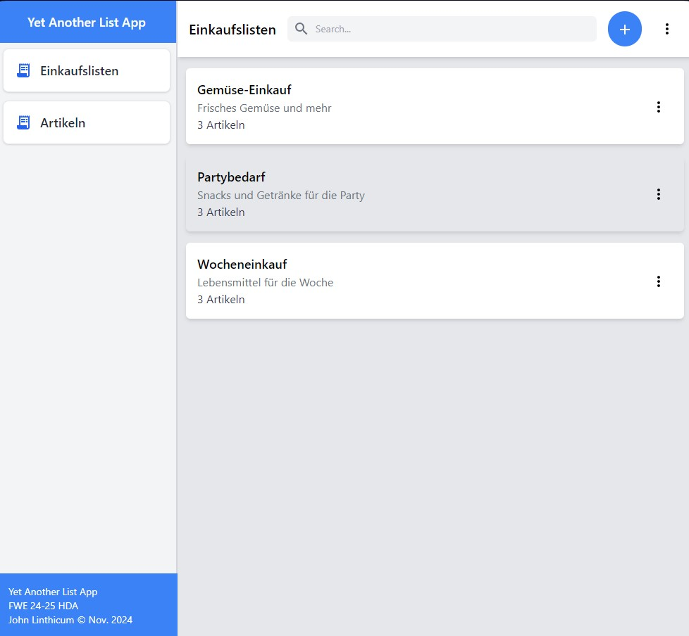
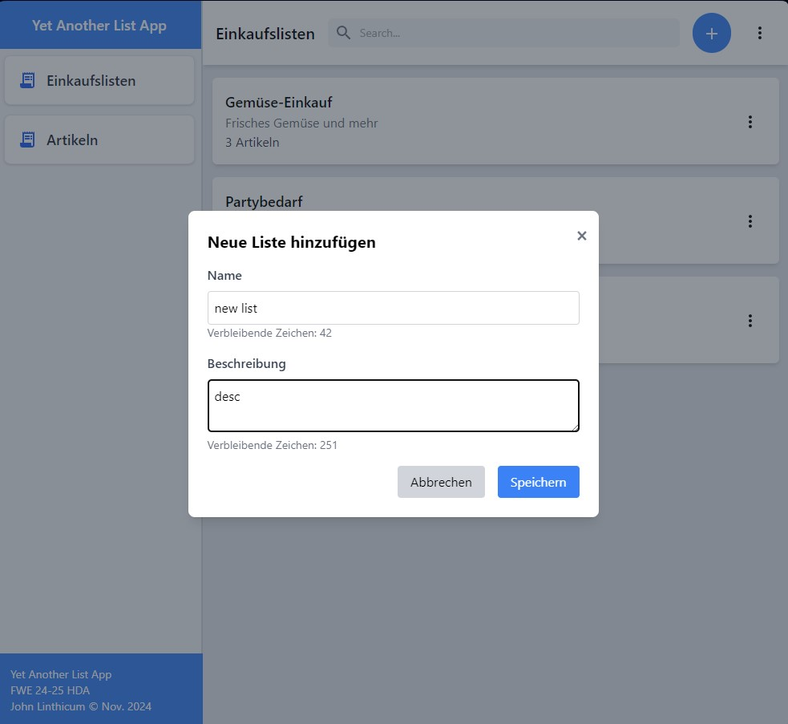
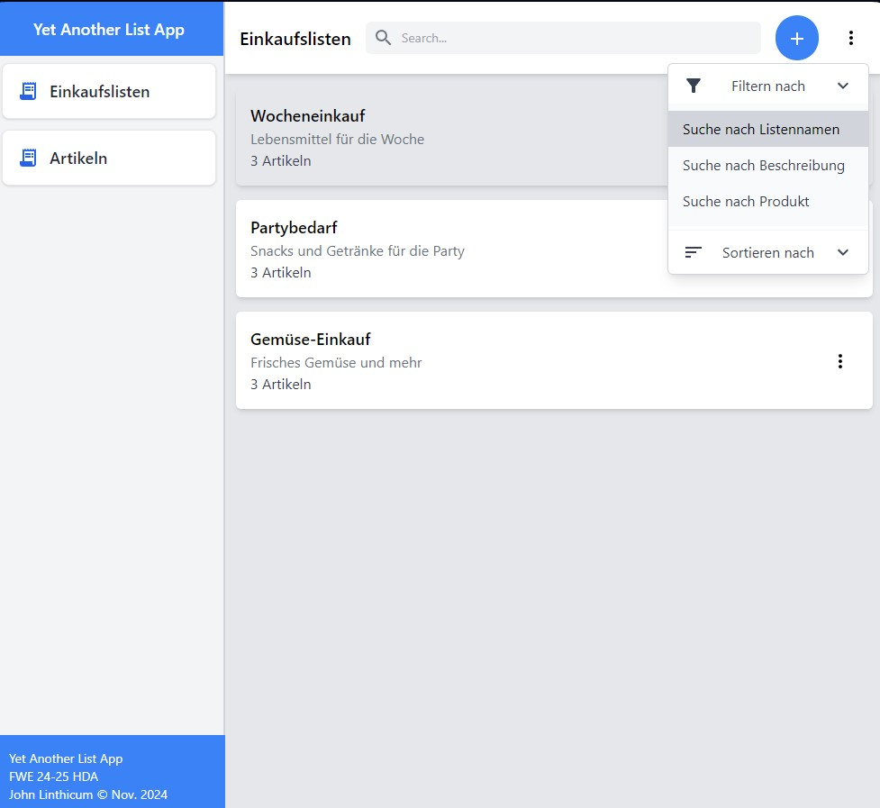
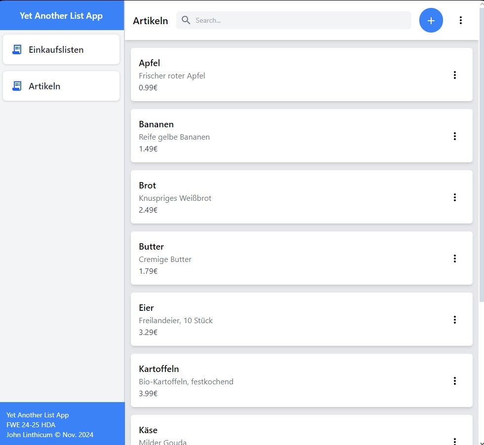
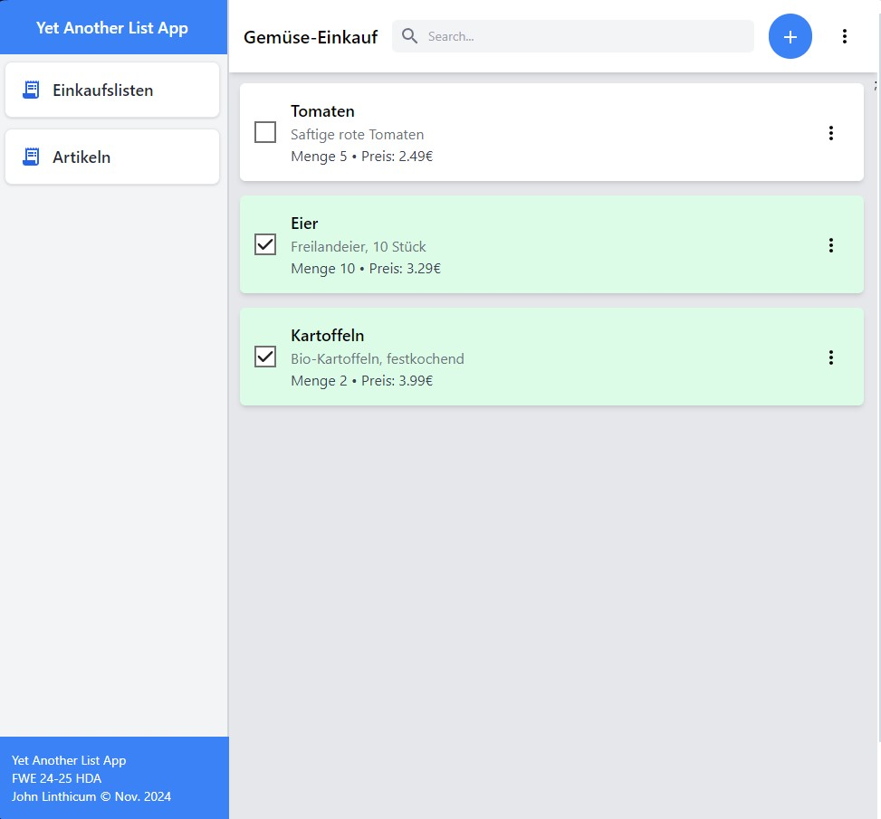
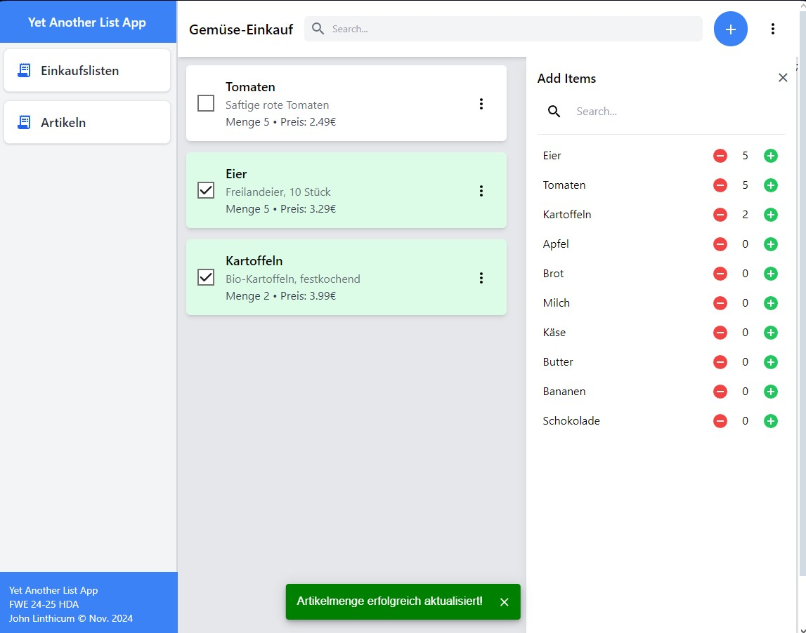

# YALO - Yet Another List App

This repository contains the source code for a Simple Shopping List App, created as part of my Web Development course at my university. The project demonstrates building a simple REST API for database interactions and a frontend interface for managing shopping lists. It is a monorepo project, meaning that the frontend and backend are in the same repository.

## Table of Contents
- [Features](#features)
- [Technologies Used](#technologies-used)
  - [Frontend](#frontend)
  - [Backend](#backend)
  - [Database](#database)
  - [Infrastructure](#infrastructure)
- [Prerequisites](#prerequisites)
- [Screenshots](#screenshots)
- [Getting Started](#getting-started)
  - [Running with Docker Compose](#running-with-docker-compose)

## Features
- **Add and Delete Shopping Lists**: Users can create and remove shopping lists through the frontend
- **Add and Delete Items**: Users can add and delete reusable items to a shopping list
- **Custom Components**: All UI components are built from scratch using Tailwind CSS, avoiding heavy reliance on component libraries (for learning purposes)
- **TypeScript Integration**: The project was developed with TypeScript to strengthen type safety and improve maintainability
- **Minimal Dependencies**: Focused on learning Tailwind CSS and TypeScript by limiting external libraries
- **Containerized**: The entire application stack is containerized using Docker for easy deployment and development

## Technologies Used

### Frontend
- React with TypeScript
- Tailwind CSS

### Backend
- Node.js (REST API)
- Express.js

### Database
- MongoDB

### Infrastructure
- Docker & Docker Compose
- Node.js Alpine (Frontend) and Node.js (Backend) base images

## Prerequisites

Before running the application, ensure you have the following installed on your system:

- **Docker**: Version 20.10.0 or higher
  - [Docker Installation Guide](https://docs.docker.com/get-docker/)
- **Docker Compose**: Version 2.0.0 or higher (included with Docker Desktop)
  - [Docker Compose Installation Guide](https://docs.dcdsocker.com/compose/install/)
- **Git**: For cloning the repository
  - [Git Installation Guide](https://git-scm.com/book/en/v2/Getting-Started-Installing-Git)

### Optional (for local development without Docker)
- Node.js: Version 18 or higher
- npm: Version 8 or higher
- MongoDB: Version 5.0 or higher

## Screenshots

### Shopping List Overview


### Search and Filter Interface


### List Details View


### Product Management Interface


### Responsive Mobile Layout


### List Item Management Interface


## Getting Started

### Running with Docker Compose

The application is fully containerized and can be started with a single command:
```bash
docker-compose up --build
```

This will start three containers:
- Frontend: Available at `http://localhost:3000`
- Backend: Available at `http://localhost:5000`
- MongoDB: Running on port `27017`

To stop the application:
```bash
docker-compose down
```
